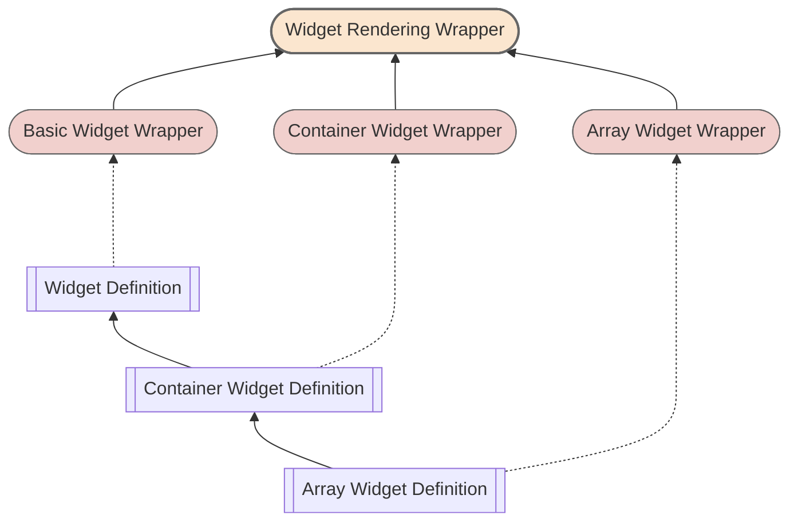

# d9-n1

It is the No.1 project of group `d9`, which is created at 9th. Dec. 2022.  
This project is higher-order widgets for ui configuration, which describe the interfaces, behaviours of underlay widgets.

# Idea

[d9](https://github.com/InsureMO/rainbow-d9/blob/main/README.md)

# Add Into Your Project

```bash
yarn add @d9/n1
```

> If you develop based on the `d9` component library or the `d9` Markdown configuration method, you can skip the above steps as this library
> will be installed along with the relevant libraries when you install them.

# Development Guide

## The Only Component

`d9-n1` provides a standalone root entrypoint, Typically, all internal pages are rendered based on configuration definitions.

```typescript jsx
import {NodeDef, StandaloneRoot} from '@d9/n1';
import {Fragment, useEffect} from 'react';

interface AppState {
	loaded: boolean;
	data?: BaseModel;
	def?: NodeDef;
}

const askState = async (): Promise<AppState> => {
	// ask data and page definition from remote
};

const App = () => {
	const [state, setState] = useState<AppState>({loaded: false});

	useEffect(() => {
		(async () => {
			setState(await askState());
		})();
	}, []);

	if (!state.loaded) {
		return <Fragment />;
	}

	return <StandaloneRoot $root={state.data!} {...def} />;
};
```

A simple page configuration (base on `d9-n2` widgets) might be as below,

```json
{
	"$wt": "Page",
	"$nodes": [
		{
			"$wt": "Input.FC",
			"label": "Name",
			"$pp": "name"
		}
	]
}
```

There is an input with label should be rendered, and bind value between via given property path (`$pp`).

## Widgets Rendering

### Types

In `d9`, there are only three types of widgets:

- Basic widgets, such as input, dropdown, etc.
- Container widgets, such as Section.
- Array widgets, such as tables.

All widgets are standardized under these three types of widgets.



#### Basic Widget

Rendering and handling a piece of data, which can be of any type. These types of widgets cannot contain any child components.

#### Container Widget

Rendering and handling a piece of data, which must be an object. These types of widgets can contain child widgets and should provide their
own layout options.

#### Array Widget

Rendering and handling a piece of data, which must be an array, typically an object array. These types of widgets can contain child
widgets and should provide their own layout options. Additionally, each element in the array will be rendered according to the declared
definition.

### Widget Registration

Creating a new widget does not require inheritance from a base interface. Instead, it is done through a registration method.

Here is an example of registering a `Button` widget from `d9-n2`:

```typescript
import {registerWidget} from '@rainbow-d9/n1';

export const Button = forwardRef((props: ButtonProps, ref: ForwardedRef<HTMLButtonElement>) => {
	// ...
}
registerWidget({key: 'Button', JSX: Button, container: false, array: false});
```

| Property    | Description                                                                                                                  |
|-------------|------------------------------------------------------------------------------------------------------------------------------|
| `key`       | Key of widget, global unique. If it has already been registered, the previous component will be overwritten.                 |
| `JSX`       | A react component which follows `d9` standard.                                                                               |
| `container` | Identify the widget is container or not.                                                                                     |
| `array`     | Identify the widget is array or not. Please note that when `array` is set to `true`, `container` must also be set to `true`. |

## Common Properties of Widget

### Widget Type

Each widget should specify a type ($wt) and ensure its uniqueness globally.

### Data Model

Each widget has two data models: `$root` and `$model`. `$model` is theoretically a child node of the `$root` tree structure, used for
rendering and handling the current component.

### Property Path

Each widget has two property paths: `$p2r` (path to root) and `$pp` (property path).

- `$p2r` indicates the relationship between `$model` and `$root`, which usually computed by the component itself during rendering,
- `$pp` specifies the relationship between the current property value and `$model`, which needs to be explicitly defined.

> If the path is declared as `.`, it represents the current object. For example, `$p2r = '.'` means `$model` is equivalent to `$root`.

### Location in Parent

`d9` widgets are positioned using the most popular grid system, and each component can be defined through declarations. It's important to
note that since the position of a component is defined relative to its parent container, the actual layout is not provided by `d9-n1`, but
rather by the implementation of the container itself. However, we recommend that all container implementations that can accommodate child
widgets follow the grid layout approach. To fully adapt to this layout, the position definition information of the widgets includes
four attributes: row, column, rowSpan, and colSpan. You can refer to `NodePosition` for details.

### Children of Container

The child widgets of a container widget are specified through the `$nodes` property, which is an array. Therefore, in theory, a
container widget can contain anywhere from 0 to an infinite number of child widgets.

### Behavior of Element in Array Container

For array widgets, there are additional behavior definitions for different scenarios involving their child elements. These definitions
can be specified using the `$array` property, as shown in the declaration of `ArrayUsedDef`. The behaviors include:

| Property             | Description                                                                                                                                                                                                                                                 |
|----------------------|-------------------------------------------------------------------------------------------------------------------------------------------------------------------------------------------------------------------------------------------------------------|
| `noElementReminder`  | How to render when there are no child elements.                                                                                                                                                                                                             |
| `addable`            | Is it allowed to add child elements or not.                                                                                                                                                                                                                 |
| `addLabel`           | The label used for adding child elements operation, typically displayed on a button.                                                                                                                                                                        |
| `createElement`      | When adding new child elements, how to construct the initial state of the child elements.                                                                                                                                                                   |
| `elementAdded`       | After the child element is constructed and added to the current array, perform additional processing on the new child element. Returning a `Promise` is allowed.                                                                                            |
| `removable`          | Is it allowed to remove an existing child element or not.                                                                                                                                                                                                   |
| `removeLabel`        | The label used for removing child element operation, typically displayed on a button.                                                                                                                                                                       |
| `couldRemoveElement` | Whether the child element to be removed is actually allowed to be removed. This is typically an additional check before the removal operation is initiated on the page. This function will return a `Promise<boolean>` for the system to make the judgment. |
| `elementRemoved`     | After the child element is removed from the current array, perform additional processing on the new child element. Returning a `Promise` is allowed.                                                                                                        |
| `getElementKey`      | Specify how to calculate the `key` for child element. Similar to the `key` for React components, the system needs a unique key to ensure the rendering accuracy.                                                                                            |

> The specific usage of the above properties will be described in more detail in the subsequent chapters. Here, the purpose is to establish
> a preliminary understanding of the behavior of array widget.

# Event and Communication between Widgets

Unlike the implementation of general component libraries (using functions to handle component events and triggering React refresh to achieve
page refresh), 'd9' aims to minimize performance issues caused by global refresh. Therefore, 'd9' categorizes page changes into the
following standard ways in its design:

- Visibility,
- Availability (Enablement),
- Data validation,
- Change response (Reaction).

Any page change should be expressed in the form of data change and handled through targeted event subscription and response.

Let’s look at a very simple example in a general programming implementation:

```typescript jsx
const Page = () => {
	const [visiblility, setVisibility] = useState('block');

	const onValueChange = (event: ChangeEvent<HTMLInputElement>) => {
		const {value} = event.target;
		if (value.trim().length === 0) {
			setVisibility('block');
		} else {
			const v = Nubmer(value);
			if (isNaN(v)) {
				setVisibility('none');
			} else {
				setVisibility('block');
			}
		}
	}

	return <div>
		<input type="text" onChange={onValueChange} />
		<span style={{display: visiblility}}>Hello World.</span>
	</div>
}
```

In the example above, the label is initially visible and remains visible when the input field is empty or contains a number. It becomes
invisible otherwise. However, in the real world, a page or even a section of a page can contain dozens or even hundreds of similar
widgets. If the interaction between all these widgets is written in such a way, it may result in frequent re-rendering of the entire
page or section, affecting all the content. Even with the premise of virtual DOM diffing in React, it can still easily lead to performance
issues on the page.

To address this problem as much as possible, communication must be restricted to relevant component scopes, avoiding global refresh as much
as possible. Therefore, `d9` adopts the following approach:

```typescript jsx
const def = {
	$wt: 'Page',
	$nodes: [
		{$wt: 'Input', $pp: 'visibility'},
		{
			$wt: 'Caption', $pp: 'visibility', label: 'Hello World.',
			$visible: {
				$watch: ['visibility'],
				$handle: ({model}) => {
					const value = model.visibility;
					if ((value || '').trim().length === 0) {
						setVisibility('block');
					} else {
						const v = Nubmer(value);
						if (isNaN(v)) {
							setVisibility('none');
						} else {
							setVisibility('block');
						}
					}
				},
				$default: () => true
			}
		}
	]
}
const Page = () => {
	const {model} = useState({visibility: 'block'});

	return <StandaloneRoot $root={model} {...def} />
}
```

Let's take a look at how 'd9' works through the diagram below,

```mermaid

```