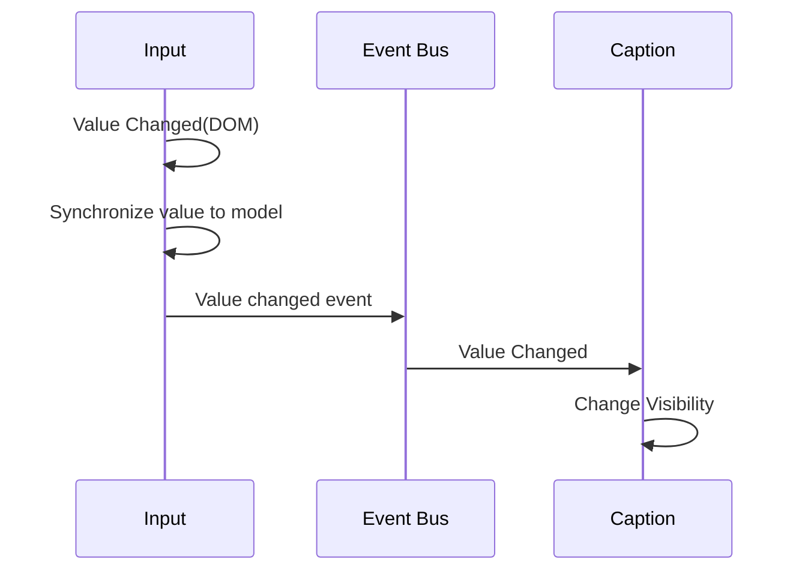

# d9-n1

It is the No.1 project of group `d9`.  
This project is higher-order widgets for ui configuration, which describe the interfaces, behaviours of underlay widgets.

# Idea

[d9](https://github.com/InsureMO/rainbow-d9)

# Add Into Your Project

```bash
yarn add @rainbow-d9/n1
```

> If you develop based on the `d9` widget library or the `d9` Markdown configuration method, you can skip the above steps as this library
> will be installed along with the relevant libraries when you install them.

# Development Guide

## The Only Component

`d9-n1` provides a standalone root entrypoint, Typically, all internal pages are rendered based on configuration definitions.

```typescript jsx
import {NodeDef, StandaloneRoot} from '@rainbow-d9/n1';
import {Fragment, useEffect} from 'react';

interface AppState {
	loaded: boolean;
	data?: BaseModel;
	def?: NodeDef;
}

const askState = async (): Promise<AppState> => {
	// ask data and page definition from remote
};

const App = () => {
	const [state, setState] = useState<AppState>({loaded: false});

	useEffect(() => {
		(async () => {
			setState(await askState());
		})();
	}, []);

	if (!state.loaded) {
		return <Fragment />;
	}

	return <StandaloneRoot $root={state.data!} {...def} />;
};
```

A simple page configuration (base on `d9-n2` widgets) might be as below,

```json
{
	"$wt": "Page",
	"$nodes": [
		{
			"$wt": "Input.FC",
			"label": "Name",
			"$pp": "name"
		}
	]
}
```

There is an input with label should be rendered, and bind value between via given property path (`$pp`).

## Widgets Rendering

### Types

In `d9`, there are only three types of widgets:

- Basic widgets, such as input, dropdown, etc.
- Container widgets, such as Section.
- Array widgets, such as tables.

All widgets are standardized under these three types of widgets.


#### Basic Widget

Rendering and handling a piece of data, which can be of any type. These types of widgets cannot contain any child widgets.

#### Container Widget

Rendering and handling a piece of data, which must be an object. These types of widgets can contain child widgets and should provide their
own layout options.

#### Array Widget

Rendering and handling a piece of data, which must be an array, typically an object array. These types of widgets can contain child
widgets and should provide their own layout options. Additionally, each element in the array will be rendered according to the declared
definition.

#### Enhancement Widget

Typical is a basic widget, but it is defined in a form that adds a suffix and includes any widget to achieve enhanced behavior.

For example, `Input.FC`, `Input` presents an input, and `FC` presents form cell, which add a label at top and an error message label at
bottom.

### Widget Registration

Creating a new widget does not require inheritance from a base interface. Instead, it is done through a registration method.

Here is an example of registering a `Button` widget from `d9-n2`:

```typescript jsx
import {registerWidget} from '@rainbow-d9/n1';

export const Button = forwardRef((props: ButtonProps, ref: ForwardedRef<HTMLButtonElement>) => {
	// ...
});

registerWidget({key: 'Button', JSX: Button, container: false, array: false});
```

| Property    | Description                                                                                                                  |
|-------------|------------------------------------------------------------------------------------------------------------------------------|
| `key`       | Key of widget, global unique. If it has already been registered, the previous widget will be overwritten.                    |
| `JSX`       | A react component which follows `d9` standard.                                                                               |
| `container` | Identify the widget is container or not.                                                                                     |
| `array`     | Identify the widget is array or not. Please note that when `array` is set to `true`, `container` must also be set to `true`. |

## Common Properties of Widget

### Widget Type

Each widget should specify a type ($wt) and ensure its uniqueness globally.

### Data Model

Each widget has two data models: `$root` and `$model`. `$model` is theoretically a child node of the `$root` tree structure, used for
rendering and handling the current widget.

### Property Path

Each widget has two property paths: `$p2r` (path to root) and `$pp` (property path).

- `$p2r` indicates the relationship between `$model` and `$root`, which usually computed by the widget itself during rendering,
- `$pp` specifies the relationship between the current property value and `$model`, which needs to be explicitly defined.

> If the path is declared as `.`, it represents the current object. For example, `$p2r = '.'` means `$model` is equivalent to `$root`.

### Location in Parent

`d9` widgets are positioned using the most popular grid system, and each widget can be defined through declarations. It's important to
note that since the position of a widget is defined relative to its parent container, the actual layout is not provided by `d9-n1`, but
rather by the implementation of the container itself. However, we recommend that all container implementations that can accommodate child
widgets follow the grid layout approach. To fully adapt to this layout, the position definition information of the widgets includes
four attributes: row, column, rowSpan, and colSpan. You can refer to `NodePosition` for details.

### Children of Container

The child widgets of a container widget are specified through the `$nodes` property, which is an array. Therefore, in theory, a
container widget can contain anywhere from 0 to an infinite number of child widgets.

### Behavior of Element in Array Container

For array widgets, there are additional behavior definitions for different scenarios involving their child elements. These definitions
can be specified using the `$array` property, as shown in the declaration of `ArrayUsedDef`. The behaviors include:

| Property             | Description                                                                                                                                                                                                                                                 |
|----------------------|-------------------------------------------------------------------------------------------------------------------------------------------------------------------------------------------------------------------------------------------------------------|
| `noElementReminder`  | How to render when there are no child elements.                                                                                                                                                                                                             |
| `addable`            | Is it allowed to add child elements or not.                                                                                                                                                                                                                 |
| `addLabel`           | The label used for adding child elements operation, typically displayed on a button.                                                                                                                                                                        |
| `createElement`      | When adding new child elements, how to construct the initial state of the child elements.                                                                                                                                                                   |
| `elementAdded`       | After the child element is constructed and added to the current array, perform additional processing on the new child element. Returning a `Promise` is allowed.                                                                                            |
| `removable`          | Is it allowed to remove an existing child element or not.                                                                                                                                                                                                   |
| `removeLabel`        | The label used for removing child element operation, typically displayed on a button.                                                                                                                                                                       |
| `couldRemoveElement` | Whether the child element to be removed is actually allowed to be removed. This is typically an additional check before the removal operation is initiated on the page. This function will return a `Promise<boolean>` for the system to make the judgment. |
| `elementRemoved`     | After the child element is removed from the current array, perform additional processing on the new child element. Returning a `Promise` is allowed.                                                                                                        |
| `getElementKey`      | Specify how to calculate the `key` for child element. Similar to the `key` for React components, the system needs a unique key to ensure the rendering accuracy.                                                                                            |

> The specific usage of the above properties will be described in more detail in the subsequent chapters. Here, the purpose is to establish
> a preliminary understanding of the behavior of array widget.

## Event and Communication between Widgets

Unlike the implementation of general component libraries (using functions to handle component events and triggering React refresh to achieve
page refresh), 'd9' aims to minimize performance issues caused by global refresh. Therefore, 'd9' categorizes page changes into the
following standard ways in its design:

- Visibility,
- Usability (Enablement),
- Data validation,
- Change response (Reaction).

Any page change should be expressed in the form of data change and handled through targeted event subscription and response.

Let’s look at a very simple example in a general programming implementation:

```typescript jsx
const Page = () => {
	const [visiblility, setVisibility] = useState('block');

	const onValueChange = (event: ChangeEvent<HTMLInputElement>) => {
		const {value} = event.target;
		if (value.trim().length === 0) {
			setVisibility('block');
		} else {
			const v = Nubmer(value);
			if (isNaN(v)) {
				setVisibility('none');
			} else {
				setVisibility('block');
			}
		}
	}

	return <div>
		<input type="text" onChange={onValueChange} />
		<span style={{display: visiblility}}>Hello World.</span>
	</div>
}
```

In the example above, the label is initially visible and remains visible when the input field is empty or contains a number. It becomes
invisible otherwise. However, in the real world, a page or even a section of a page can contain dozens or even hundreds of similar
widgets. If the interaction between all these widgets is written in such a way, it may result in frequent re-rendering of the entire
page or section, affecting all the content. Even with the premise of virtual DOM diffing in React, it can still easily lead to performance
issues on the page.

To address this problem as much as possible, communication must be restricted to relevant widget scopes, avoiding global refresh as much
as possible. Therefore, `d9` adopts the following approach:

```typescript jsx
const def = {
	$wt: 'Page',
	$nodes: [
		{$wt: 'Input', $pp: 'visibility'},
		{
			$wt: 'Caption', $pp: 'visibility', label: 'Hello World.',
			$visible: {
				$watch: ['visibility'],
				$handle: ({model}) => {
					const value = model.visibility;
					if ((value || '').trim().length === 0) {
						return true;
					} else {
						const v = Nubmer(value);
						if (isNaN(v)) {
							return false;
						} else {
							return true;
						}
					}
				},
				$default: () => true
			}
		}
	]
}
const Page = () => {
	const {model} = useState({visibility: 'block'});

	return <StandaloneRoot $root={model} {...def} />
}
```

Let's take a look at how `d9` works through the diagram below,



As you can see, with the involvement of the Event Bus, the `Value Change` event is precisely transmitted to the "Caption" widget without
affecting any other widgets. This helps to avoid the issue of global refresh.

> The `Page`, `Input`, and `Caption` widgets in the above example are from the `d9-n2` module.

### Visibility

Visibility can be either a boolean value or a listener. In general cases, boolean values are typically used when definition data that needs
to be dynamically updated. Now let’s look at the definition of a listener:

| Property   | Description                                                                                                                                                    |
|------------|----------------------------------------------------------------------------------------------------------------------------------------------------------------|
| `$watch`   | The properties of interest will receive notifications and trigger the invocation of the processing function when their values change.                          |
| `$handle`  | When a change of interest is detected, the `NodeAttributeValueHandle` is used to calculate the new property value.                                             |
| `$default` | The default value can be either a boolean value or a function that returns a boolean value, as seen in `NodeAttributeDefaultValueInitializer`. It is optional. |

> Visibility is defined using the `$visible` property on the widget.

> The monitored property definition can be either a relative path or an absolute path. If it is an absolute path, it starts with a `/`.

### Usability (Enablement)

The definition of Usability (Enablement) is identical to Visibility, but it is used for handling usability of a widget rather than its
visibility.

> Usability (Enablement) is defined using the `$disabled` property on the widget.  
> Please note that if the value is true, it means that the widget is not available.

### Data Validation

The definition of data validation is similar with others, with the difference that

- The `$watch` property is optional. When `$watch` is not defined, data validation only responds to changes in widget value change itself.
- Without the `$default` attribute, the system can generally assume that the initial state value is always correct or that it is yet to be
  filled in and waiting for the first data validation trigger.

> Data Validation is defined using the `$valid` property on the widget.

It is important to note that when validation is triggered, the widget always needs a way to notify the user of what problem
has occurred. Therefore, the data validation listener function returns a `ValidationResult` object, which indicates whether validation
has passed and provides corresponding reasons if it fails.

> How to display the reasons for validation failures will be supported by the widget itself and is not within the scope of implementation
> in `d9-n1`.

### Change Response (Reaction)

In fact, visibility, usability, and data validation are all special forms of responding to data changes, and `d9-n1` extracts and defines
these three behaviors separately for convenience in defining widget behavior. However, in a broader scope, widgets may have more
complex response behaviors to data changes. Therefore, any response behavior beyond these, "d9-n1" defines as Data Response (Reaction).

> Data Response (Reaction) is defined using the `$reaction` property on the widget.

Data Response (Reaction) does not have a `$default` property because it responds to data changes. In the initial state, there is no data
change, so a `$default` is not needed.

`d9-n1` defines two standard data response behaviors, referring to `Reaction`. The built-in functions have already made reasonable responses
to standard response indicators:

- `Reaction.REPAINT`: Forces the component to refresh.
- `Reaction.CLEAR_VALUE`: Clears the property values defined in the component and refreshes the component.

However, based on the actual widget requirements, there may still be other response indicators. In such cases, the widget
should be responsible for implementing the corresponding response behaviors by receiving the `WrapperEventTypes.UNHANDLED_REACTION_OCCURRED`
event. Below is an example from the `Dropdown` in `d9-n2`:

```typescript jsx
export const REACTION_REFRESH_DROPDOWN_OPTIONS = 'reaction-refresh-dropdown-options';

export const Dropdown = (props: DropdownProps) => {
	// ...

	const {on: onWrapper, off: offWrapper} = useWrapperEventBus();

	// ...

	useEffect(() => {
		if (onWrapper != null && offWrapper != null) {
			// only works when it is wrapped by n1
			// eslint-disable-next-line  @typescript-eslint/no-explicit-any
			const onUnhandledReactionOccurred = (command: any) => {
				if (command !== REACTION_REFRESH_DROPDOWN_OPTIONS) {
					return;
				}
				setCandidates(candidates => ({initialized: false, options: candidates.options}));
			};
			onWrapper(WrapperEventTypes.UNHANDLED_REACTION_OCCURRED, onUnhandledReactionOccurred);
			return () => {
				offWrapper(WrapperEventTypes.UNHANDLED_REACTION_OCCURRED, onUnhandledReactionOccurred);
			};
		}
	}, [onWrapper, offWrapper]);

	// ...
};
```

## External Definition

As is well known, functions cannot be serialized, and only pure JSON can be serialized. Therefore, when configuration data needs to be
serialized and stored, the definition of functions becomes a significant obstacle. In order to solve this problem, `d9-n1` introduces the
concept of external definitions, which means that through certain associations, the defined contents can be precisely associated with the
functions in the code, so that external functions can be accessed during rendering.

Here is an example, base on `Dropdown` widget from `d9-n2`:

```typescript jsx
const externalDefs: ExternalDefs = {
	codes: {
		genders: async (): Promise<DropdownOptions> => {
			try {
				// load dropdown options remotely
			} catch (e) {
				console.error(e);
				return [];
			}
		}
	}
};
const def = {
	$wt: 'Page',
	$nodes: [
		{$wt: 'Dropdown.FC', label: 'Gender', $pp: 'gender', options: {$keys: 'codes.genders'}}
	]
};

return <StandaloneRoot {...def} $root={model} externalDefs={externalDefs} />;
```

## Hooks

- `useCreateEventBus`: to create an event bus, the built-in event bus includes the following:
	- `RootEventBusProvider`, `RootEventBus`, `useRootEventBus`: effective globally starting from the root,
	- `WrapperEventBusProvider`, `WrapperEventBus`, `useWrapperEventBus`: effective within each wrapper scope,
	- `ContainerEventBusProvider`, `ContainerEventBus`, `useContainerEventBus`: effective within each container wrapper scope,
	- `ArrayElementEventBusProvider`, `ArrayElementEventBus`, `useArrayElementEventBus`: effective within each array sub-element scope.
- `useForceUpdate`: to force refresh this widget,
- `useThrottler`: to create a new throttler,
- `useValueChanged`: to create a function for handling value changes, which will trigger value change events and data validation events. It
  is worth noting that there is a throttle setting for events, which is set to `150ms` by default. It can be changed using
  the `setValueChangedDelay` function. This is a global setting,
- `useSetValue`: to create a function for synchronizing value to model, which will trigger function `valueChanged` if it is declared in
  definition, see `ValueChangeableNodeDef` for more function declaration,

> For other lower-level hooks, should refer to the source code.

### Handle Root Event by Yourself

In programming mode, due to the characteristics of React itself, and the properties exposed by `StandaloneRoot` such
as `leading?: ReactNode; children?: ReactNode; tailing?: ReactNode;`, we can perform additional processing on `RootEventTypes`. However, it
is important to note that this will not affect the built-in event handling logic of `d9`.

Let's take a look at a simple example:

```typescript jsx
const ModelListener = (props: { model: BaseModel }) => {
	const {model} = props;
	const {on, off} = useRootEventBus();

	useEffect(() => {
		const onValueChanged = () => {
			// ... handle value changed event here
		};
		on(RootEventTypes.VALUE_CHANGED, onValueChanged);
		return () => {
			off(RootEventTypes.VALUE_CHANGED, onValueChanged);
		};
	}, [on, off, fire, model]);
	return <Fragment />;
};

const Page = () => {
	// ...

	return <StandaloneRoot $root={initModel} {...def} externalDefs={externalDefs}>
		<ModelListener model={initModel} />
	</StandaloneRoot>
}
```

## Utilities

`d9-n1` provides a set of utility functions for data manipulation:

- `MUtils`: Data model operations
- `NUtils`: Model definition operations
- `PPUtils`: Property path operations
- `VUtils`: Value validation and operations.

## Logger

`d9-n1` provides a logging function called `N1Logger`. Here are sample of logger:

```typescript
// to enable from `debug` level, default is enabled on `warn` level
N1Logger.enableLevel('debug');
// error log, last argument is logger category
N1Logger.error(`Listener on [${type}] was added into ${name} bus, check it.`, 'CreateEventBusHook');
// disable or enable a specific logging category on level
N1Logger.disable('CreateEventBusHook.error');
// disable or enable a specific logging category on all levels
N1Logger.enable('CreateEventBusHook');
// enable a specific level, relevant and more important levels will be enabled.
// levels are ranked from low to high in terms of importance: debug, trace, log, info, warn, error
N1Logger.enableLevel('debug');
// disable a specific level, relevant and less important levels will be disabled.
N1Logger.enableLevel('info');
```
