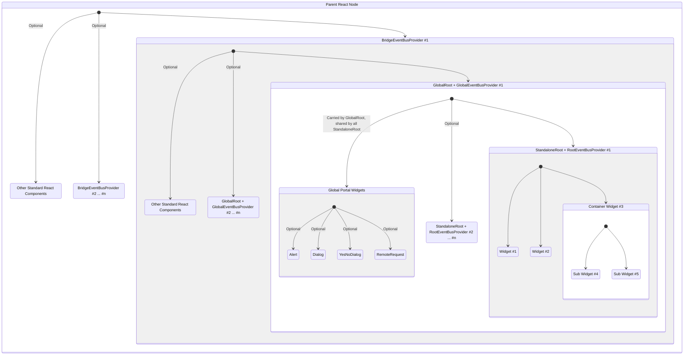

# d9-n2

It is the No.2 project of group `d9`.  
This project is widgets implementation for ui configuration, under `d9` widget standard.

# Idea

[d9](https://github.com/InsureMO/rainbow-d9)

# Add Into Your Project

```bash
yarn add @rainbow-d9/n2
```

# Icons

All icons are copied from [Font Awesome](https://fontawesome.com/), free set.

# Widgets

`d9-n2` is a lightweight widget library based on the `d9` standard and implemented with `styled-components`. Currently, it includes the
following widgets:

- Input, NumberInput
- Textarea
- Dropdown
- Multiple Values Dropdown (MultiDropdown)
- Checkbox, Checkboxes (Checks)
- Radio, Radios
- Calendar, DateCalendar, DateTimeCalendar
- Button, ButtonBar
- Caption, Label
- Section
- Tabs
- Wizard
- Page
- Ribs, ImmutableRibs (also known as RibsView)
- Table
- Pagination
- Tree
- FormCell (Enhancement widget, which used to include other widget and provide standard capabilities such as labeling and displaying
  error messages.)

We will not provide detailed descriptions for each widget here. You can refer to the corresponding definitions and source code for the
individual properties standards of each widget. Instead, we will discuss some important features and principles of widget design here.

## Parameterized Styling

In `d9-n2`, we use CSS variables to achieve modifiable widget stylesheets. When you render a widget, you can open the stylesheet and
find the parameters used by that widget.

Here is a runtime sample for `Dropdown`,

```css
/** crFLOD is generated css key, by styled-components */
.crFLOD {
    display: flex;
    position: relative;
    -webkit-box-align: center;
    align-items: center;
    padding: 0 var(--d9-input-indent, 10px);
    outline: none;
    appearance: none;
    border: var(--d9-border, 1px solid var(--d9-border-color, rgb(206, 212, 218)));
    border-radius: var(--d9-border-radius, 4px);
    height: var(--d9-input-height, 32px);
    background-color: transparent;
    transition: all var(--d9-transition-duration, 300ms) var(--d9-transition-timing-function, ease-in-out);
    cursor: pointer;
    width: 100%;
}
```

Therefore, by providing corresponding variable values on the appropriate DOM nodes, you can change the style of the widget.
Additionally, for more precise style control, each widget provides a `data-w` attribute. By specifying and targeting this attribute in
CSS, you can achieve uniform style changes. For example, you can control the style of a `Dropdown` widget by
using `div[data-w=dropdown] {}`. If you need precise control over a specific instance of a widget, we recommend adding custom attributes
in the widget definition, such as `{'data-customized': true}`, and then using `[data-customized=true] {}` in CSS to control it.

## Unwrapped Widgets

All widgets provide an `Unwrapped` mode, mainly designed to offer a pure programming approach. When a widget is
unwrapped, it is no longer bound to the core operations of `d9`, allowing users to control the widget in a way that closely resembles
natural DOM manipulation.

Here is an example to demonstrate the difference between the two approaches:

```typescript jsx
// configuration mode
const def = {
	'$wt': 'Page',
	'$nodes': [{'$wt': 'Input.FC', 'label': 'Name', '$pp': 'name'}]
};
<StandaloneRoot $root={model} {...def} />;

// programming mode
const forceUpdate = useForceUpdate();
const onRemarksChange = (value: PropValue) => {
	model.name = value;
	forceUpdate();
}
<UnwrappedInput value={model.name} onValueChange={onValueChange}/>
```

# Global Hooks

`d9-n2` additionally provides a set of global Hooks, including:

- Dialog,
- Alert,
- Confirmation,
- Remote Request Reminder.

To activate global hooks, you first need to use `GlobalEventBusProvider` in your program. The usage is identical to regular hooks, and you
can access specific usage methods through `GlobalEventBus` and `useGlobalEventBus`.

## Language Switch

After setting `$d9n2.intl.language`, use `GlobalEventTypes.LANGUAGE_CHANGED` to switch languages.

## Custom Event

To use `GlobalEventTypes.CUSTOM_EVENT` to send a custom event globally, the custom event consists of four parts:

- `key`: A string that represents the custom event itself, which is essentially a combination of `prefix` and `clipped`,
- `prefix`: A string that indicates the type of the custom event,
- `clipped`: A string that represents the content of the custom event,
- `models`: The data models that send the event, including the `root` model and the current `model` properties.

The following are the built-in types of custom events:

- Global,
	- `GlobalEventPrefix.ALERT`: open an alert. No default event handling, and it needs to be handled by yourself,
	- `GlobalEventPrefix.DIALOG`: open a dialog. No default event handling, and it needs to be handled by yourself,
	- `GlobalEventPrefix.CUSTOM`: fully custom event. No default event handling, and it needs to be handled by yourself,
- Section,
	- `GlobalEventPrefix.EXPAND_SECTION`: expand a section, `clipped` should be a section marker,
	- `GlobalEventPrefix.COLLAPSE_SECTION`: collapse a section, `clipped` should be a section marker,
	- `GlobalEventPrefix.SECTION_EXPANDED`: section expanded, `clipped` should be a section marker,
	- `GlobalEventPrefix.SECTION_COLLAPSED`: section collapsed, `clipped` should be a section marker,
- Table,
	- `GlobalEventPrefix.EXPAND_TABLE_ROW`: expand a table row, `clipped` should serve as both a table marker and a row marker/index, joined
	  by a dash `(-)`,
	- `GlobalEventPrefix.COLLAPSE_TABLE_ROW`: collapse a table row, `clipped` should serve as both a table marker and a row marker/index,
	  joined by a dash `(-)`,
- Ribs,
	- `GlobalEventPrefix.EXPAND_RIBS_ELEMENT`: expand a ribs element, `clipped` should serve as both a ribs marker and a row marker/index,
	  joined by a dash `(-)`,
	- `GlobalEventPrefix.COLLAPSE_RIBS_ELEMENT`: collapse a ribs element, `clipped` should serve as both a ribs marker and a row
	  marker/index, joined by a dash `(-)`,
- Tabs,
	- `GlobalEventPrefix.TAB`: active a tab, `clipped` should be a tab marker,
	- `GlobalEventPrefix.TAB_CHANGED`: tab changed, `clipped` should be a tab marker,
- Wizard,
	- `GlobalEventPrefix.WIZARD_STEP`: active a step, `clipped` should be a step marker,
	- `GlobalEventPrefix.WIZARD_STEP_CHANGED`: step changed, `clipped` should be a step marker.
- Tree,
	- `GlobalEventPrefix.REFRESH_TREE`: refresh a tree, `clipped` should be tree marker,
	- `GlobalEventPrefix.EXPAND_TREE_NODE`: expand a tree node, `clipped` should be tree node marker,
	- `GlobalEventPrefix.COLLAPSE_TREE_NODE`: collapse a tree node, `clipped` should be tree node marker,
	- `GlobalEventPrefix.REFRESH_TREE_NODE`: refresh a tree node, `clipped` should be tree node marker, only node itself.
	- `GlobalEventPrefix.REFRESH_TREE_CHILD_NODES`: refresh all child nodes of a tree node, `clipped` should be tree node marker, only
	  child nodes for display will be recalculated,
	- `GlobalEventPrefix.RECALC_TREE_CHILD_NODES`: refresh all child nodes of a tree node, `clipped` should be tree node marker, all child
	  nodes will be recalculated,
	- `GlobalEventPrefix.REFRESH_TREE_NODE_AND_CHILDREN`: refresh all child nodes of a tree node, `clipped` should be tree node marker, node
	  itself and all child nodes for display will be recalculated,
	- `GlobalEventPrefix.RECALC_TREE_NODE_AND_CHILDREN`: refresh all child nodes of a tree node, `clipped` should be tree node marker, node
	  itself and all child nodes will be recalculated,
	- `GlobalEventPrefix.TREE_NODE_CLICKED`: a tree node clicked, `clipped` is tree node marker,
	- `GlobalEventPrefix.TREE_NODE_DOUBLE_CLICKED`: a tree node double-clicked, `clipped` is tree node marker,
	- `GlobalEventPrefix.TREE_NODE_CONTEXT_MENU`: a tree node clicked for context menu, `clipped` is tree node marker,

# Typical Layers



# Logger

`d9-n2` provides a logging function called `N2Logger`, exactly same as `N1Logger`.

# Automation Friendly

Due to the complexity and dynamism of modern web pages, precise component targeting in automated web page testing is often a challenging
issue. To address this challenge and facilitate automation testing, `d9-n2` provides a special attribute called `data-wid` for component
targeting. The value of this attribute is generated based on the widget's property path definition, which ensures
predictability and stability to the greatest extent possible. Additionally, if the widget is enhanced by a `Form Cell`, the corresponding
DOM node generated by the `Form Cell` will also have a corresponding attribute, prefixed with `fc-` for differentiation.